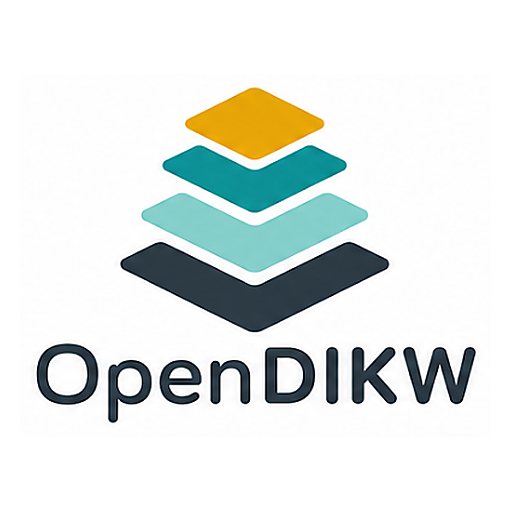
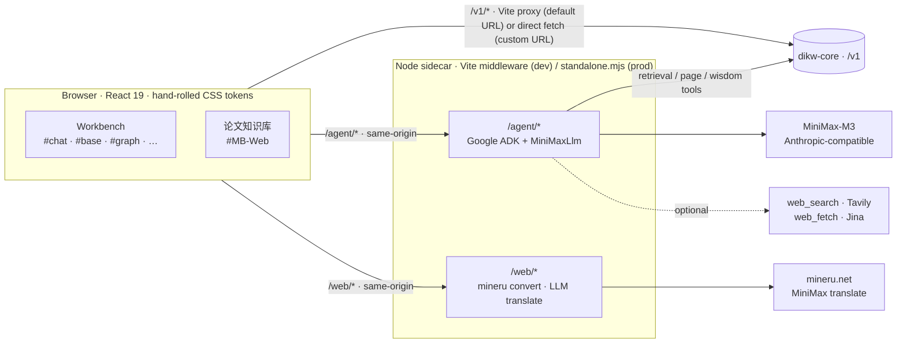

<div align="center">



# dikw-web

**A React + Vite knowledge workbench over [`dikw-core`](https://github.com/OpenDIKW/dikw-core)** — chat agent, knowledge graph, bilingual Markdown reader, and document import & ingest in one same-origin bundle.

[](https://github.com/OpenDIKW/dikw-web/actions/workflows/ci.yml)
[](https://github.com/OpenDIKW/dikw-web/actions/workflows/codeql.yml)


**[Quick start](#quick-start) · [Commands](#commands) · [Architecture](#architecture-in-one-diagram) · [Routes](#routes) · [Branding](#branding-white-label) · [Deployment](#deployment) · [Docs](#where-canonical-docs-live)**

</div>

---

The browser app consumes `dikw-core`'s `/v1` HTTP API; a small Node
sidecar runs alongside the dev server and exposes same-origin `/agent/*`
routes for chat plus `/web/*` routes for browser-side helpers (mineru-backed
PDF / Office conversion for Import, and on-demand LLM markdown translation
for the Base reader).

This bundle ships **two front-ends** selected by the URL hash: visiting
`#MB-Web` opens the focused 论文知识库 (paper knowledge base) reading variant
(`src/mb/`, `MbApp`), while every other hash (`#chat`, `#base`, …) loads the
original multi-page workbench. Both consume `dikw-core` over `/v1` —
predominantly reads, plus explicit write surfaces (Import / paper upload,
the Wisdom editor, the Tasks maintenance ops); see `CLAUDE.md` → "Routes and contracts
(hash-based)" for the split.

## Quick start

```sh
# install
npm install

# dev server (fixed at http://127.0.0.1:4321)
npm run dev

# point Settings → Server URL at your local dikw-core (default http://127.0.0.1:8765)
```

> **Shell convention:** the examples in this README use plain `npm`, which works on
> **macOS / Linux**. On **Windows PowerShell**, call `npm.cmd` instead (e.g.
> `npm.cmd run dev`) — `CLAUDE.md` standardizes on the `.cmd` form for that shell.

When the visible Server URL is the default, browser `/v1` calls go through
the Vite proxy to avoid CORS; any other URL is requested directly.

## Commands

macOS / Linux use `npm`; Windows PowerShell uses `npm.cmd` (see the shell
convention above). Commands themselves are identical across platforms.

| Command | What it does |
|---|---|
| `npm run dev` | Vite dev server on `127.0.0.1:4321` (`--strictPort`) |
| `npm run typecheck` | `tsc --noEmit` |
| `npm run lint` | ESLint flat config, `--max-warnings 0` (hook deps, unused symbols, no browser `console`) |
| `npm run format` / `format:check` | Prettier across code (`.ts/.tsx/.js/.mjs/.css/.json`; markdown excluded) |
| `npm run test` | Vitest once (unit + component + server) |
| `npm run test:watch` | Vitest watch mode |
| `npm run test:coverage` | Vitest with coverage thresholds (60 / 45 / 55 / 60) |
| `npm run test:e2e` | Playwright (Chromium); auto-starts dev server if needed |
| `npm run build` | `tsc --noEmit` + `vite build` (browser to `dist/`) + `build:server` (esbuild to `dist-server/standalone.mjs`) |
| `npm run verify` | Full gate: lint + format:check + typecheck + coverage + build + e2e |
| `npm run check:bundle` | gzip bundle budget (entry JS / total JS / CSS) against `dist/`; runs in CI after `verify` |
| `npm run smoke:core` | Live `/v1` contract smoke against a reachable `dikw-core` (not a CI gate; run after a core bump or before a demo) |
| `npm run live:verify` | Live integration: boot a **real `dikw-core`** (GHCR image + Postgres, dynamic ports), seed the write pipeline, then run read smoke + a `live` Playwright project + an agent↔core check against it. Needs Docker + `.env.core` (copy `.env.core.example`). Not part of `verify`. See [`docs/integration-verification.md`](docs/integration-verification.md) |

Single-file iteration:

```sh
npx vitest run src/components/MarkdownView.test.tsx
npx playwright test tests/e2e/wiki.spec.ts
```

If `npm run dev` fails in the Codex sandbox with `Cannot read
directory "../../.."`, fall back to (use `/` paths on macOS / Linux, `\` on Windows):

```sh
# macOS / Linux
node node_modules/vite/bin/vite.js --host 127.0.0.1 --port 4321 --strictPort --configLoader runner

# Windows PowerShell
node node_modules\vite\bin\vite.js --host 127.0.0.1 --port 4321 --strictPort --configLoader runner
```

## Architecture in one diagram



The `/web/*` family is **job + poll**: `convert` / `translate` `submit`
returns a job id immediately, then the browser polls `…/jobs/<id>` and
fetches `…/jobs/<id>/result` (with `…/cancel` to abort); `…/health`
endpoints drive Import's format degradation and gate the Base reader's
AI 翻译 entry. See `CLAUDE.md` for the full wire shapes.

Two source trees share a single sidecar process (mounted into the Vite
dev server as middleware, and into `dist-server/standalone.mjs` for prod):

1. **Browser app** in `src/` — React 19 + TypeScript, no UI framework.
   Hand-rolled CSS token system in `src/styles.css`.
2. **Sidecar** in `server/agent/` + `server/web/` + `server/shared/` —
   `/agent/*` mounted by `agentSidecarPlugin()` (Google ADK chat), `/web/*`
   mounted by `webApiPlugin()` (browser helpers: mineru conversion + on-demand
   LLM translation). Both plugins are defined under `server/*/vitePlugin.ts`
   and registered in `vite.config.ts`. Sessions persist to local SQLite in
   `.agent-sessions/agent.sqlite` (gitignored).

## Routes

Hash-based. Settings owns connection state.

- `#chat` — canonical chat. Legacy `#query` redirects here.
- `#trace` — hidden (URL-only, not in the sidebar): per-session
  conversation + an OpenTelemetry span waterfall from
  `/agent/sessions/{id}/traces`. Spans are in-memory and ephemeral.
- `#base` — Base reader (sidebar label "Base", page heading "Base" in en / "知识库" in zh-CN). Shows the `source` + `knowledge` layers; wisdom lives on `#wisdom`. Tree from `/v1/base/pages?active=true`;
  body from `/v1/base/pages/{path}`. Tabs: Read / Info / Outline / Source. English pages gain a fused **AI translate** toggle on the Read tab (when `/web/translate` is configured) that renders a paragraph-aligned Chinese dual column. The legacy `#wiki` hash no longer resolves (falls back to `#overview`).
- `#graph` — read-only knowledge map; consumes
  `/v1/base/graph?active=true`. Pixi.js + d3-force.
- `#overview`, `#wisdom`, `#tasks`, `#retrieve`, `#settings` — see
  `docs/core-contract.md` for endpoint mapping.

## Markdown reader

`src/components/MarkdownView.tsx` renders source- and knowledge-layer
markdown bodies (the shared renderer also backs the bilingual dual column).
Supports:

- Pipe tables, sanitized raw HTML tables (narrow allow-list).
- Safe `<details>/<summary>` blocks.
- KaTeX inline `$...$` and block `$$...$$`.
- Mermaid fenced code (lazy-imported; `securityLevel: "strict"`).
- Standard CommonMark `` and Obsidian-style `![[assets/images/<sha>.jpg]]` image embeds — resolved
  through `PageReadResult.assets[]` and streamed from
  `/v1/assets/{asset_id}`. When a session token is set, images are
  hydrated via authenticated `fetch` + `URL.createObjectURL` so the
  `Authorization` header is honored.
- Chart blocks `<details><summary>bar|line|scatter|heatmap</summary>`
  wrapping a markdown pipe table — rendered with Apache ECharts
  (lazy-imported per-module). Honors dark mode. Falls back to a
  `<details>` table when the chart code fails to load, the spec is
  malformed, or `init` throws — so users never lose the source data.

Arbitrary raw HTML, scripts, event attributes, and inline styles must
not become live DOM.

## Chat sidecar

The agent runs on **Google ADK** (`@google/adk`); the LLM is MiniMax-M3
via its Anthropic-compatible endpoint through a custom `MiniMaxLlm`
adapter (`@anthropic-ai/sdk` transport). The browser only ever calls
same-origin `/agent/*` and the `AgentStreamEvent` NDJSON wire shape is
stable across the runtime. The sidecar:

- Receives the current Settings `Server URL` and optional bearer token
  on each request; rejects requests without a `coreUrl` rather than
  falling back to `.env.local`.
- Calls `dikw-core` retrieval / page / wisdom / health endpoints as
  tools.
- Optionally calls `web_search` (Tavily) and `web_fetch` (Jina) when
  `DIKW_AGENT_TAVILY_API_KEY` / `DIKW_AGENT_JINA_API_KEY` are present
  in `.env.local`. A Brave client is retained in
  `WebToolClient.search` for future provider rotation but is not
  registered as an agent tool.
- Persists sessions to local SQLite (`.agent-sessions/agent.sqlite`) via
  ADK's `DatabaseSessionService`. The stored events must not contain LLM
  keys or browser session-storage values.

Local credentials (LLM keys, optional web tool keys, `DIKW_WEB_MINERU_API_KEY`
for Import PDF / Office conversion) live in `.env.local` (gitignored via
`*.local`). The Base-reader translation feature reuses the chat agent's LLM
credentials (`DIKW_AGENT_API_KEY` / `_BASE_URL` / `_MODEL`); no separate key.
Use `.env.example` as the template.

## Settings & state

- `dikw-web.serverUrl` (localStorage) — selected core base URL. Owned by the
  Settings page, committed on an explicit Save (Clear resets to the default).
- `dikw-web.token` (localStorage) — bearer token, never displayed in chrome.
  Persisted to `localStorage` so the connection is shared across tabs and
  survives a restart (the token is therefore at rest by default). MB-Web reads
  it and its gear opens `#settings` to edit it (issue #97).
- `dikw-web.locale` (localStorage) — `en` or `zh-CN`, defaults to `en`.
- `dikw-web.theme` (localStorage) — `system` / `light` / `dark`,
  defaults to `system`. Applied as `html[data-theme="..."]`. Shared by the
  workbench and MB-Web: MB-Web reads it (resolving `system` to light/dark) and
  its one-tap header toggle writes an explicit `light`/`dark` back to this same
  key, so appearance is unified across both apps. Only the workbench Settings
  appearance panel sets the full 3-state preference.

## Branding (white-label)

The sidebar logo text and browser tab title default to `OpenDIKW`
(`src/config/branding.ts`). To rebrand without rebuilding, drop a
`config.json` into the served static root (`public/` in dev, `dist/` or a
mounted volume in prod) — copy the shape from
[`public/config.example.json`](public/config.example.json):

```json
{ "brand": { "name": { "en": "Acme-DIKW", "zh-CN": "示例知识库" } } }
```

(`Acme-DIKW` / `示例知识库` are placeholders — substitute your own brand.)
The app fetches `/config.json` once at startup; a missing or malformed file
falls back to the `OpenDIKW` defaults. `name` is per-locale (a bare string
applies to all locales) and the tab title follows it. `config.json` is
gitignored so per-deployment branding never lands in the repo. The logo
image and favicon are fixed — only text is configurable. The breadcrumb
root is a fixed `Workbench` / `工作台` label, independent of the brand.

## Testing

TDD for behavior changes: failing test first, smallest change to green,
then refactor. Vitest (jsdom) covers components, utilities, the client
boundary, and the sidecar; Playwright (Chromium) covers routes, i18n
chrome, dark-mode contrast, markdown rendering (including image and
chart fixtures via `tests/e2e/mockApi.ts`), chat layout, and graph
interactions. Coverage thresholds live in `vite.config.ts`; don't
lower them to make a feature pass.

## Deployment

For production, build and run as a single self-contained Node service that
serves the SPA plus the same-origin `/agent/*` sidecar. LLM credentials are
injected via env; users still pick the external dikw-core URL in Settings.

```sh
npm run build   # produces dist/ and dist-server/
npm start       # node dist-server/standalone.mjs
```

A Docker image is the recommended deployment form. See
[`docs/deployment.md`](docs/deployment.md) for required env vars, the
`docker run` / `docker compose` recipes, and notes on connecting to an
external dikw-core (host networking + CORS).

Telemetry export is opt-in via standard `OTEL_*` env (traces + metrics + logs,
plus optional browser RUM). A self-contained demo stack —
`docker compose -f docker-compose.observability.yml up` (OTel Collector →
Jaeger + Prometheus + Loki + Grafana) — and the full env reference are in
[`docs/observability.md`](docs/observability.md).

## Where canonical docs live

- `CLAUDE.md` — operational guide for Claude Code sessions (working
  principles, architecture, testing, patch intake).
- `docs/deployment.md` — production deploy (Docker, env vars, networking).
- `docs/core-contract.md` — the `dikw-core` HTTP subset this app
  consumes (Settings, Overview, Base Pages, Assets, Graph, Chat, Tasks).
- `docs/ui-system.md` — visual tokens, markdown reader contract,
  graph canvas rules, components.
- `docs/graph-view.md` — Graph View architecture and rendering.
- `docs/agent.md` — ADK agent sidecar (MiniMaxLlm, ADK runner/session
  store, sqlite sessions, OpenTelemetry `#trace`), tool registry.
- `docs/observability.md` — OpenTelemetry export (traces + metrics + logs +
  browser RUM): `OTEL_*` env reference, the `dikw.*` metric catalog, and a
  local demo stack (`docker-compose.observability.yml`).
- `docs/tdd.md` — TDD workflow for this project.
- `docs/integration-verification.md` — `npm run live:verify`: end-to-end
  verification against a real `dikw-core` (GHCR image + Postgres).
- `docs/adr/` — Architecture Decision Records (one decision per file,
  prefixed `NNNN-`).

## Project layout

```
src/
  api/             DikwClient + AgentClient + NDJSON helpers
  components/      MarkdownView, GraphCanvas, BilingualView, shared UI pieces
  pages/           one file per workbench route (Chat, Graph, Wiki/Base, Overview, Tasks, Settings, Trace, …)
  mb/              the #MB-Web 论文知识库 front-end (MbApp + mb.css)
  config/          branding + telemetry runtime config, connection keys
  hooks/           useAsyncResource, useBilingualReader, usePreviewTranslation
  state/           import-pipeline + wisdom-write client state
  telemetry/       browser RUM bootstrap (initBrowserOtel)
  utils/           pure helpers (chart-spec, frontmatter, graph adapters, kebab names, format)
  styles.css       hand-rolled token system — the UI baseline
server/
  agent/           ADK agent sidecar, MiniMaxLlm, tools, sqlite sessions, OTel
  web/             /web/* helpers — mineru convert + LLM translate (job + poll)
  shared/          logger, metrics, env, withServerSpan (cross-sidecar)
tests/e2e/         Playwright specs + mockApi fixtures
docs/              canonical product/contract notes (see above)
```
