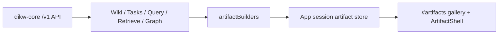

# Artifact Studio

Artifact Studio turns already-loaded `dikw-core` API data into structured,
copyable reading reports. It is a web-only presentation layer in v1.

## Safety Boundary

- Facts come only from existing `/v1` API responses already consumed by
  the visible pages.
- The web app does not read the filesystem, import external HTML, execute
  user scripts, or persist artifacts to disk.
- Generated artifacts live only in the current browser session state.
- Raw source data stays available in a collapsed `Raw data` block so the
  derived report can be audited.

## Artifact Types

- `knowledge_explainer`: generated from the selected Wiki/Base page body.
  It surfaces TL;DR, headings, wikilinks, anchors, and document stats.
- `run_report`: generated from a terminal task plus loaded task events. It
  surfaces event timeline, progress rows, ingest file errors, final result,
  and raw event data.
- `answer_report`: generated from Query or Retrieve final stream state. It
  surfaces answer text, citations, retrieval hits, applied wisdom, chunks,
  and page refs.
- `graph_explainer`: generated from the focused graph node. It surfaces the
  center node, inbound/outbound counts, one-hop neighbors, unresolved
  wikilinks, and source navigation.

## Data Flow

`artifactBuilders` accept page view models and return controlled
`ArtifactDocument` objects. They never generate arbitrary HTML.

## Testing Boundary

- App shell tests cover `产物 / Artifacts` navigation and session gallery
  storage.
- Component tests cover `ArtifactShell`, table of contents, metrics, raw
  JSON collapse, and copy-as-markdown.
- Page tests cover each generation entry point.
- Playwright smoke covers Wiki, Tasks, Query, and Graph artifact generation
  with mocked `/v1` API responses.

## Future Core Contract

If `dikw-core` later adds `/v1/artifacts`, keep the current tests as the
behavior contract and move builder logic behind the API boundary. The web
surface should continue to render `ArtifactDocument` and keep raw source
data auditable.
