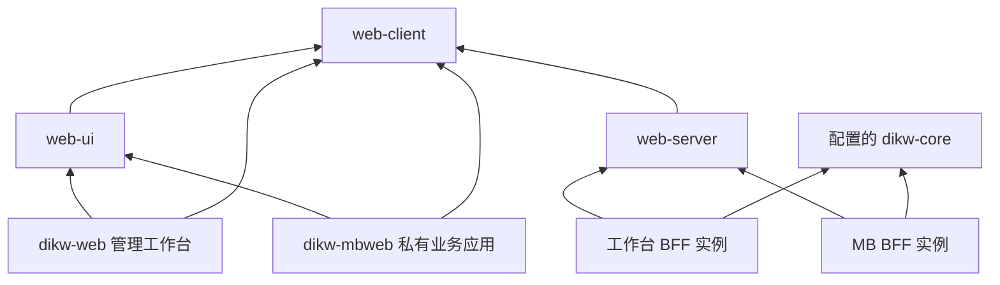

# dikw-web 与 dikw-mbweb 拆仓设计

本方案把当前一个构建产物中的管理工作台和迈博业务应用拆成两个可独立开发、测试、部署的应用。共享能力由公开的 `dikw-web` 仓库维护，以 MIT 许可证发布到公开 npm；`dikw-mbweb` 仅保存业务应用及其定制代码，作为私有仓库。目标是让通用修复只实现一次，同时让业务需求和发布节奏独立。

本文描述目标架构与迁移约束；配套的[实施计划](../plans/2026-10-03-mbweb-repository-split.md)列出交付任务。日期为 2026-10-03，分析基线为 `b7df6af2020f2a3c1a8ec26eb0aca0ee6522951d`，应用版本为 `0.11.0`。文中的新接口和新文件是设计目标，尚未实现。

## 决策与范围

| 项目 | 决策及状态 |
| --- | --- |
| 应用仓库 | 已确认拆为公开 `dikw-web` 与私有 `dikw-mbweb`，后者位于兄弟目录 |
| 共享方式 | 已认可版本化共享包，初期保存在 `dikw-web/packages/` |
| 包分发 | 维护者已选择公开 npm |
| 共享包许可 | 维护者已选择 MIT；仅对共享包声明许可，私有应用保持 `private: true` 与 `UNLICENSED` |
| 服务端 | 推荐每个应用部署自己的 BFF 实例，共享运行库；BFF 指持有凭证、代理 Core 并处理应用请求的服务端 |
| Core 拓扑 | 维护者已确认 A：两套应用共用同一个 Core 知识库，工作台作为管理入口，MB 作为业务入口；BFF、权限配置、登录会话与部署独立 |
| 私有仓库归属 | 计划使用 `OpenDIKW/dikw-mbweb`；创建前核实组织写入权限与仓库是否已存在 |
| 旧 Git 历史 | 保留 `dikw-web` 公开历史；MB 新仓库从迁移快照开始，记录原始提交与作者来源 |

本次包含代码拆分、共享包、私有仓库、配置解除耦合、服务端能力边界、历史浏览器数据迁移、CI 与部署验证。MB 的论文库、阅读、问答、笔记、上传流程保持现有产品行为。知识库多租户、服务端笔记系统、业务 UI 重设计、换 UI 框架、改 Core HTTP 协议不属于此次改造。

## 当前结构与实际耦合

| 位置 | 当前行为 | 拆分要求 |
| --- | --- | --- |
| `src/main.tsx` | 根据 `#MB-Web` 选择 `MbApp`，两套前端随一次 Vite 构建发出 | 两个独立入口，工作台产物移除 MB 页面 |
| `src/mb/` | 保存论文库、阅读器、问答、笔记、上传编排和业务样式 | 迁入私有仓库，相关测试一同迁移 |
| `src/mb/connection.ts` | 读取工作台 `dikw-web.serverUrl` 与 `dikw-web.token` | MB 自己拥有连接配置；鉴权部署从服务端配置 Core |
| `src/mb/MbApp.tsx` 与 `PaperLibrary.tsx` | 设置按钮和错误提示跳转工作台 `#settings` | 跳转 MB 的配置或诊断入口 |
| `src/mb/theme.ts` 与 `src/i18n.ts` | 主题机制和工作台字典、存储 key 同处一层 | 提取主题机制，分别保存应用偏好与业务文案 |
| `src/styles.css` 与 `src/mb/mb.css` | MB 依赖全局设计变量及部分公共样式 | 分出 tokens、控件和阅读器样式，保留各自布局 |
| `server/` | 两套应用共用 OIDC、Core 代理、Agent、Web jobs 和静态资源服务 | 同一运行库，两套实例、配置、数据卷和日志标识 |
| `server/agent/http.ts` 等 | 服务端反向引用 `src/config/connection` 和 `src/agent/types` | 协议类型移入共享 client 包，运行库脱离应用源码 |
| `server/agent/adkTools.ts` | MB 的问答也能拿到 `propose_maintenance_action` | 业务 Agent 不注册维护工具，并拒绝对应 HTTP 操作 |
| `src/mb/upload.ts` | 上传后调用 `/v1/ingest`、`/v1/synth`，当前参数影响整个所连接知识库 | 保留正常上传链路，明确共用 Core 时的数据影响 |
| 浏览器存储 | 笔记用 `dikw-mb.notes`，论文别名用 `dikw-mb.paperNames`；转换和翻译缓存使用 IndexedDB | 不因换域名丢失笔记与别名；缓存允许重建 |

## 架构选择

| 方案 | 收益 | 成本 | 结论 |
| --- | --- | --- | --- |
| 两个应用仓库，公共包保存在 `dikw-web` | 工作台和公共能力可一次修改验证；私有应用只依赖包 | 共享包仍由工作台仓库发布 | 首期采用 |
| 两个应用仓库，另建公共组件仓库 | 组件维护、权限和发布完全独立 | 增加一个仓库以及跨仓库联调、发版工作 | 有第三个消费者或独立维护团队时再评估 |
| 两个应用仓库，各自复制公共代码 | 初次移动直接 | 鉴权、渲染和任务修复长期需要同步两份实现 | 不采用 |

公开仓库不能引用私有应用。所有共享包只能依赖其他共享包和公开第三方依赖；应用可依赖共享包，不能相互导入源码。

## 仓库与代码归属

`dikw-web` 保留现有根目录命令、`src/App.tsx`、管理页面和薄的服务启动入口，新增 `packages/`，使用 npm workspaces。首期不再移动整个工作台到 `apps/`，减少无关路径变化。

`dikw-mbweb` 自己保存 `src/main.tsx`、`src/App.tsx`、`src/features/research/`、`src/features/notes/`、`src/features/upload/`、`src/models/`、`src/config/`、`src/styles/`、`server/main.ts`、测试、Dockerfile、CI、lockfile 和部署文档。把目前 `MbApp` 内定义的 `MbNote`、`CurrentPaper` 等类型移到 MB 的 `src/models/`，避免业务组件依赖应用入口。

| 目标包与公开入口 | 迁移来源及责任 | 留在应用内的内容 |
| --- | --- | --- |
| `@opendikw/web-client`，入口 `/core`、`/agent`、`/types` | `src/api/`、`src/types.ts`、`src/agent/types.ts`、`traceTypes.ts`；Core 与 Agent HTTP/NDJSON 协议 | 路由、文案、鉴权后的页面装配 |
| client 的 `/import`、`/convert`、`/translate`、`/document`、`/connection` | 已被两套应用使用的归档构建、资产路径、Markdown 解析、语言判断、格式化、转换/翻译客户端及相关依赖闭包；连接默认值 | MB 上传阶段、错误文案、整条上传编排、笔记到 Wisdom 的映射 |
| `@opendikw/web-ui`，入口 `/controls`、`/reader`、`/hooks`、`/auth`、`/theme` | 公共控件、Markdown runtime、双语阅读、异步 hooks、AuthContext、登录状态探测与主题机制 | 两套应用各自的 App shell、导航、Settings 页面、业务文案 |
| UI 的 `/tokens.css`、`/controls.css`、`/reader.css` | 现有 CSS 中对应实际公共组件的规则及依赖变量；KaTeX 的 CSS 与字体必须随构建解析 | 工作台页面/图谱布局与 MB `.mb-*` 布局 |
| `@opendikw/web-server`，入口 `/runtime`、`/instrumentation`、`/vite` | `server/auth`、`agent`、`web`、`shared` 的生产能力及现有 Vite sidecar 适配；共享 #204/#205 实现和测试 | 应用入口、环境注入、静态目录、应用 profile、私有业务扩展 |

`GraphCanvas`、管理页专用组件和只被单个应用使用的工具保留原位。复用实际相同的渲染与协议逻辑；不把 PaperLibrary、NotesView、QaPanel 抽成带大量业务开关的通用页面。

## 共享包接口与构建约束

三个包首发版本统一为 `0.1.0`，首期一起维护版本和发布批次。两个应用版本分别维护，不以 npm 包版本代替应用版本。应用依赖使用精确的共享包版本并提交 lockfile；发布后的消费者仅通过公开 `exports` 导入。

client 的 `/core`、`/agent`、`/types` 在模块初始化时不得读取 `window`、localStorage 或 IndexedDB。浏览器工具在对应子入口调用时才访问浏览器能力。`web-server` 只消费协议类型和连接默认值，不加载 UI、CSS、DOM 工具。

包采用 ESM，发布编译后的 `.js`、`.d.ts` 和所需 CSS/静态资源。`files` 显式列出 `dist`、README、LICENSE；不发布应用源码、客户资产、环境文件、测试 fixture 或 sqlite 数据。JS 与声明文件的相对导入采用 `.js` 扩展名，构建声明与运行时分别检查。client 和 server 使用 NodeNext 编译检查；UI 使用适合 Vite 消费的 ESM 输出和声明。每个实际子入口有打包后安装验证。

React 和 react-dom 在 UI 包声明 `>=19 <20` 的 peer dependencies，由应用提供，并在 UI 构建中 external。不要把 React 或 React context 内联进包，避免应用和控件拿到不同 React 或 AuthContext 实例。Mermaid/ECharts 保留动态加载；基础控件入口不得把阅读器、图谱或 Node 运行库带入浏览器入口。

CSS 显式按层引入。tokens 保留现有变量名称和亮暗主题；controls 包含其 DOM 实际使用的规则，避免带入管理布局；reader 包含 Markdown/双语阅读规则。CSS 和 KaTeX 等第三方 CSS 标记为有副作用，不能被 tree shaking 删除。共享主题接受应用自己的存储 key，工作台继续使用 `dikw-web.theme`，MB 使用自己的 key；翻译字典与品牌配置分别属于应用。转换和翻译 cache 的开启函数增加可选 namespace，未指定时保留现有数据库名，MB 使用自己的身份/Core 分区。

保留 Node `>=24.0.0`、React 19、TypeScript、Vite、Vitest、Playwright 与现有 npm。不引入 Nx、Turborepo、Lerna 或 UI 框架。当前分析环境为 Node `24.15.0`、npm `11.12.1`。由于 `.npmrc` 设置 `ignore-scripts=true`，包构建、CSS 复制、发包前检查必须显式运行，不能依赖 `prepare`、`prepack`、`postinstall`。

## 两套应用的服务端与能力边界

运行库提供 `createWebRuntime(options)`，返回应用 HTTP handler 与可等待的 `close()`；不在被 import 时监听端口或安装进程退出钩子。应用入口负责读取环境、初始化 instrumentation、创建 runtime、监听端口、健康检查及 SIGTERM 关闭。保留数据库格式、OIDC 加密格式、HTTP/NDJSON 响应和 graceful shutdown 行为。

`options` 只引入两套应用实际需要的 `appId`、`profile`、`cwd`、`staticDir` 和环境注入。profile 为 `workbench | mbweb`，由服务端入口指定，不能由 Cookie、请求参数或浏览器选择。现有 `DIKW_WEB_*`、`DIKW_AGENT_*`、`DIKW_CORE_URL`、`DIKW_SERVER_TOKEN` 环境变量首期继续使用，MB 通过独立容器环境得到独立值。

工作台 profile 保持现有路由和 viewer/editor 规则。MB profile 增加路由能力白名单，未知 API 默认拒绝；当前角色矩阵继续适用。白名单在鉴权、角色检查之后、代理和 handler 执行之前强制执行。开发模式也保留 profile 限制：Vite 的应用 middleware 必须在 `/v1` proxy 和 `/agent`、`/web` sidecar 之前应用同一策略，不能只保护 standalone。Vite 适配位于独立 `/vite` 子入口，生产 `/runtime` 不依赖 Vite，Vite 声明为可选 peer dependency。

| 能力 | MB 的处理 |
| --- | --- |
| 健康探针、登录、回调、退出、当前用户 | 保留现有端点与 #205 会话策略 |
| 论文列表、页面读取、资产获取、检索、Wisdom 读取 | 开放现有阅读和问答所需 Core 端点 |
| Agent 会话创建/读取/重命名/删除、流式问答 | 保留用户隔离，开放业务需要的现有端点 |
| 翻译与转换 jobs | 保留 #204 的用户归属和 #205 的活跃会话语义；转换仍要求 editor |
| `/v1/import`、`/v1/ingest`、`/v1/synth`、`/v1/base/wisdom` | editor 可用于现有上传和笔记链路；不改变参数和响应协议 |
| `GET /v1/tasks/{id}` 与 `/events` | 用于上传和 Wisdom 写入跟踪；不开放管理任务列表或管理取消操作 |
| lint/eval/distill/review 等管理写操作、Agent proposal 操作、管理 trace 接口 | MB profile 拒绝；editor 也不能绕过应用 profile |
| 未列入白名单的 `/v1`、`/agent`、`/web` API | 拒绝；路径规范化必须与实际 handler 一致，异常编码不能绕过策略 |

业务 Agent 仅注册已有的知识读取与按配置启用的外部检索工具，移除 `propose_maintenance_action`，同步调整系统提示。即使请求携带旧 proposal id，HTTP 层也拒绝确认操作；既检查工具集，也检查外部 HTTP 行为。

OIDC 继续使用同一 Casdoor/IdP，但建议注册两个 client，分别配置 redirect URI、logout URI 和角色映射。两套 BFF 使用独立 secret、host-only Cookie、auth.sqlite、agent.sqlite 和 volume；不同应用不互读会话，不复制数据库来实现 SSO。身份提供方的登录体验以真实双应用验证为准。工作台沿用当前 8 小时空闲、15 分钟刷新、7 天绝对上限；MB 默认相同。两端日志分别标记 `dikw-web` 和 `dikw-mbweb`，不记录凭证或客户正文。

## 共用 Core 的数据与部署关系

两套 BFF 配置同一个 Core URL/知识库，各自在服务端持有连接凭证；用户可在工作台管理 MB 已导入的数据。**会话和 Web jobs 隔离不等于知识库按用户或按应用隔离。** MB 的论文、Wisdom 笔记及 ingest/synth 结果仍进入共用知识库；现有 Core task 与内容访问规则保持原样。此次不承诺在同一个 Core 内实现个人笔记隐私或多租户。

Core 数据留在现有知识库，本次切换迁移应用和浏览器数据。两套部署的公开逻辑 `coreId` 指向同一份知识库；应用名、会话目录和密钥分别配置。上线前备份 Core，并验证 MB 已导入论文及 Wisdom 可从工作台读取和管理，工作台管理后的数据可在 MB 的业务界面读取。MB 上传仍会触发这个共用知识库的 ingest/synth；切换期间避免旧 MB 和新 MB 同时运行写入流程。

## MB 配置与浏览器数据迁移

MB 默认入口为 `/`，研究与笔记路由由 MB 自己维护。生产使用同源 BFF，Core token 不进浏览器；MB 设置入口展示连接状态、身份、主题和迁移操作。显式启用的本地开发模式可提供 MB 自有的 Server URL/token 设置，不能跳回工作台。工作台保留现有配置兼容性。

给 MB runtime 的 `/web/auth/me` 返回值增加公开 OIDC `issuer` 和非敏感、稳定的 `coreId`；后者使用部署配置 `DIKW_WEB_CORE_ID` 的公开逻辑标识，不能返回 Core token 或内网地址。工作台保持现有字段和行为；client 支持这两个可选字段，MB 在生产启动时要求它们可用。MB 以 `issuer + sub + coreId` 的稳定哈希对笔记、论文别名和应用浏览器缓存分区。本地无鉴权模式使用 `issuer=local`、`subject=local`，coreId 来自显式开发配置或规范化的已选 Core URL。哈希用于 key 组织，不作为加密。退出/切换身份时清空当前渲染与内存问答，持久数据按其分区保留。

这是本次新增的 MB 本地存储边界。应用须等待身份和异步 namespace 就绪后加载本地数据；身份/Core 变化时取消旧分区的读取与请求，迟到结果不能进入新分区。不能把旧的不含身份 key 自动归给首次登录用户。跨域迁移采用用户主动导出、主动导入，不使用 query 参数传递笔记、凭证或自动跨域共享 localStorage。

旧入口保留一个有限的迁移页，只在 `#MB-Web` 被打开时懒加载，读取 `dikw-mb.notes` 与 `dikw-mb.paperNames`，提供下载迁移 JSON 和打开新 MB 的按钮。导出器把两组数据作为不透明 JSON 记录处理，不依赖私有 `MbNote` 模型或业务页面。目标 URL 从工作台配置读取并限制为部署配置的固定 http/https URL；没有配置时显示迁移说明，不猜域名。

MB 导入器校验版本、字段、笔记关键属性与数量/文件大小限制，首期上限为 `10 MiB`、`10,000` 条笔记；显示数量与目标账号后由用户导入。按 `nid` 合并而非覆盖，保留已有目标数据，保留来源路径与 Wisdom 关联；同一文件重复导入不重复笔记。恢复本地数据时不自动重发 Wisdom 写请求。迁移成功后原站点数据继续保留，用户可自行清理。转换/翻译缓存允许自然重建，旧 in-memory Q&A 没有持久化来源，不承诺恢复。

为避免用户在笔记同步前看不到结果，迁移页先上线，MB 导入验证通过后再移除原 MB 页面；旧入口不能在切换当天直接无提示重定向。

## npm 发布与本地联调

首次发布前验证 npm `@opendikw` scope 与三个包名的发布权限，补齐共享包 MIT LICENSE、作者/来源记录和依赖声明，保持两个应用 `private: true`。如果 scope 无发布权限，保留同名 tarball 构建与测试，先解决账户配置；不擅自改用其他公开命名空间。

发布流水线显式 build、测试、pack、检查包清单，再依赖顺序发布 client、ui、server。先发布 `0.1.0-rc.1` 到 `next`，私有 MB 和公开工作台分别验证该候选；都通过后发布正式 `0.1.0`。npm 包不可依赖开发时的 `file:`、仓库 TS 源码或外部兄弟目录。正式 CI 和 Docker 必须只通过 registry 安装精确依赖。

后续使用 GitHub-hosted Actions 的 npm trusted publishing，明确绑定组织/仓库/workflow；当前 npm 文档要求 npm CLI 至少 `11.5.1`、Node 至少 `22.14.0`，本项目保持 Node 24。首次包创建与 trusted publisher 由有 npm 权限的维护者完成账户配置。发布只从经过验证的 main/明确 release commit 运行，不在 pull_request 执行写入包仓库。[npm trusted publishing](https://docs.npmjs.com/trusted-publishers/)

应用版本继续使用各自 release tag；共享包使用 `web-kit-v<version>` 发布批次。记录已发布包与 integrity，发布失败时只重试未发布包；已存在版本内容不符时终止，修复后发布新版本。回退通过应用 lockfile 恢复旧版本，不覆盖已发布包。

本地默认使用 `npm pack` 后在临时消费目录安装三个 tarball，验证真实发包形态。需要热更新时使用显式开发联调配置，保证单 React 与同一 AuthContext，并在提交前恢复 registry lockfile。任何共享改动都必须重新验证 tarball 消费，不能仅证明 workspace 链接可用。[npm workspaces](https://docs.npmjs.com/cli/v11/using-npm/workspaces/)、[npm pack](https://docs.npmjs.com/cli/v11/commands/npm-pack/)

## CI 与 Docker

公开 CI 验证工作台和三个共享包，不克隆私有仓库、不持有访问 MB 代码的凭证。共享包内部测试和公共消费 fixture 足够作为公开 PR 的强制检查；私有业务兼容性由私有 CI 验证。候选包或公开 PR tarball 可由私有验证任务主动读取，业务报告与截图保留在私有仓库；不把业务测试内容上传公开 artifacts。

私有 CI 从 MB 仓库的空环境 `npm ci`，只下载 npm 依赖，再执行 lint、format、typecheck、coverage、build、Playwright、包预算、安全扫描与生产镜像 smoke。GHCR 如用于 MB 镜像必须明确保持 private。CodeQL 是否可用按组织私有仓库实际权限核实，不能把未配置的扫描写成已通过。

Docker 仍用 Node 24 glibc 环境，保留 `ignore-scripts` 和 SQLite 原生加载验证。workspace 引入后，公开镜像安装前复制每个 workspace manifest；生产层必须携带完整已编译共享包及其依赖，不能留下指向 builder 的软链接。MB 镜像仅从 registry 获取包，构建上下文不依赖 `../dikw-web`。生产镜像验证覆盖 node:sqlite、better-sqlite3/ADK、动态依赖、CSS/字体、健康探针、OIDC 与退出关闭。

## 验收与交付顺序

| 阶段 | 可单独验收的结果 |
| --- | --- |
| 公共 client | 两套现有界面通过包 API 访问 Core/Agent；打包后协议、取消、错误、流式结果一致 |
| 公共 UI | 两套现有界面使用同一渲染/主题机制；亮暗主题、双语阅读、图表、资产、键盘行为一致 |
| 公共 server | 工作台生产启动兼容；同一个运行库通过两个 profile 的外部 HTTP 与 OIDC 测试 |
| 私有 MB | 只克隆私有仓库即可构建、运行、发布；论文、问答、上传、笔记和身份切换正常 |
| 迁移与最终切换 | 旧入口能导出，新 MB 能幂等导入；公开源码/包/产物不再包含 MB 页面和业务资产 |

工作台现有 coverage 下限保持 statements `60`、branches `45`、functions `55`、lines `60`；包迁移后代码不能落入新的未覆盖目录。新 UI/client 包和 MB 使用不低于这些下限；服务端保留并执行全部迁移回归用例。工作台现有 gzip 预算保持 entry JS `280 KB`、total JS `1950 KB`、CSS `35 KB`；MB 首期以同样上限限制新增产物，并记录独立基线。

测试迁移清单记录原文件、目标文件、保留的行为和目标 CI。不用减少断言或扩大 exclude 处理拆分；移动测试/修改 CI 如触发 `check:gate`，按现有流程提交证据并由维护者设置 `gate-change`，不绕过 gate。

共同验收必须覆盖 #204 用户 job 隔离，#205 单次刷新、滑动过期、绝对上限、角色降级、刷新失败、退出期间竞态，以及不同应用会话隔离。UI 在真实浏览器验证亮暗主题、字体/阅读器、控制台、布局稳定和可访问性。真实 Core/Casdoor 最终集成另设验证阶段；Docker daemon 未运行或凭证未配置时保留确定性测试报告，但不能声称真实集成已完成。

## 切换与回退

上线顺序是迁移导出能力、共享包、私有 MB、双应用验证、新 MB 导入可用、最后移除工作台内 MB 页面。工作台和 MB 可以分别回退镜像与 lockfile；两套服务使用独立 volume，版本回退不删除本地数据或数据库。

旧工作台版本暂留作只读迁移出口；回退旧 MB UI 时避免与新 MB 同时写同一 Core。迁移数据格式包含版本；此次不升级 auth/agent sqlite schema，以保留 #204/#205 持久化兼容性。正式切换前备份 Core、两套服务数据卷与应用配置，记录镜像摘要、包版本与验证 commit。

## 资料与后续决策记录

代码事实见 `src/main.tsx`、`src/mb/`、`src/config/auth.ts`、`server/agent/standalone.ts`、`server/agent/http.ts`、`server/agent/adkTools.ts`、`server/auth/roles.ts`、Dockerfile、vite.config.ts 与 CI。此次先形成设计与计划，实施时同步 README、CLAUDE、CONTEXT、Core contract、UI system、Agent 和部署文档，并新增英文 ADR 记录两个应用与公共包的边界。

接口封装依据 [Node package exports](https://nodejs.org/api/packages.html#package-entry-points)；发布内容和 peer dependencies 依据 [npm package.json](https://docs.npmjs.com/cli/v11/configuring-npm/package-json/)；许可文本使用 [OSI MIT License](https://opensource.org/license/mit)。这些文档支持工具机制，应用边界和迁移顺序是本方案针对当前代码提出的设计。
